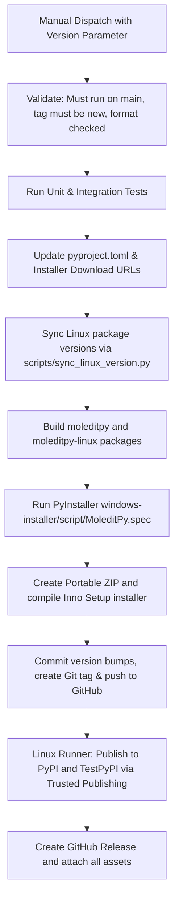

# GitHub Actions Workflows

This directory contains the CI, test release, production release, and Zenodo upload workflows for MoleditPy.

## `tests.yml` - CI Tests

Runs on pushes and pull requests targeting `main`, `master`, or `dev`, and can be manually triggered via `workflow_dispatch`.

Test matrix:

| OS | Python versions |
| --- | --- |
| Ubuntu | 3.9, 3.10, 3.11, 3.12, 3.13, 3.14 |
| Windows | 3.13, 3.14 |
| macOS | 3.13, 3.14 |

The CI workflow installs the main package from `moleditpy/` and runs all test suites (Unit, Integration, and GUI tests) in headless mode:

```bash
python tests/run_all_tests.py --no-cov --no-report
```

## `test-release.yml` - Test Release

Manually builds a complete release candidate and publishes the Python packages to TestPyPI.

Run it from GitHub Actions:

1. Open **Actions**.
2. Select **Test Release**.
3. Click **Run workflow**.
4. Select the `main` branch.
5. Enter a test version such as `3.4.1.dev1`.

This workflow:

1. Validates that it is running on `main`.
2. Validates the version input.
3. Runs unit and integration tests on `windows-latest` with Python 3.12.
4. Updates `moleditpy/pyproject.toml` in the temporary runner checkout.
5. Runs `python scripts/sync_linux_version.py`.
6. Builds `MoleditPy` and `MoleditPy-linux` distributions.
7. Builds `dist/MoleditPy/MoleditPy.exe` with PyInstaller from the Linux package source.
8. Creates `MoleditPy_<version>_win64_portable.zip`.
9. Builds `MoleditPy_<version>_win64_setup.exe` with Inno Setup.
10. Uploads all built artifacts to the workflow run.
11. Starts a separate `ubuntu-latest` publishing job.
12. Publishes both Python packages to TestPyPI.

It does not commit, tag, push, or create a GitHub Release.

## `release.yml` - Production Release

Manually builds and publishes an official release.

Run it from GitHub Actions:

1. Open **Actions**.
2. Select **Release**.
3. Click **Run workflow**.
4. Select the `main` branch.
5. Enter a release version such as `3.4.1`.

This workflow:

1. Validates that it is running on `main`.
2. Validates the version input.
3. Rejects the release if the tag already exists.
4. Runs unit and integration tests on `windows-latest` with Python 3.12.
5. Updates `moleditpy/pyproject.toml`.
6. Runs `python scripts/sync_linux_version.py`.
7. Builds `MoleditPy` and `MoleditPy-linux` distributions.
8. Builds `dist/MoleditPy/MoleditPy.exe` with PyInstaller from the Linux package source.
9. Creates `MoleditPy_<version>_win64_portable.zip`.
10. Builds `MoleditPy_<version>_win64_setup.exe` with Inno Setup.
11. Commits the version and Linux sync changes.
12. Creates and pushes the release tag.
13. Starts a separate `ubuntu-latest` publishing job.
14. Publishes both Python packages to PyPI.
15. Creates a GitHub Release and attaches the distributions, installer, and portable ZIP.

## Release Workflow Architecture

The workflows coordinate building, testing, version synchronizing, package compiling, code signing/packaging, repository tagging, and publishing to multiple indices.



### Execution Process & Validation Steps

1. **Safety Checks**:
   - Ensures the ref branch is strictly `main`.
   - Confirms that the target tag does not already exist locally/remotely to prevent overwrite.
2. **Dynamic Replacement & Cross-Compilation Sync**:
   - Modifies `pyproject.toml` (version tag).
   - Injects the new download version string into `windows_installer.md` and `windows_installer-jp.md`.
   - Runs `scripts/sync_linux_version.py` to keep the sibling package `moleditpy-linux/pyproject.toml` in lockstep.
3. **Stand-alone Executable & Installer Packaging**:
   - Executes PyInstaller using the specification file `windows-installer/script/MoleditPy.spec`.
   - Generates the portable compressed folder (`Compress-Archive` in PowerShell).
   - Generates the Windows wizard installer via Inno Setup CLI (`ISCC.exe`).
4. **Git Version-Bump Commit**:
   - Commits versioned configuration files under `github-actions[bot]`.
   - Creates a local version tag and pushes the commit/tag to GitHub.
5. **Trusted Publishing (PyPI / TestPyPI)**:
   - Uses PyPI OIDC trusted publishing. The secondary job on `ubuntu-latest` securely obtains temporary PyPI credentials via OpenID Connect (OIDC) tokens based on the configured repository publisher identity.
   - Publishes the python packages and updates the GitHub release page with installer files.

## Required PyPI Setup

Both release workflows use PyPI trusted publishing with GitHub Actions OIDC.

Configure trusted publishers for these projects:

- `MoleditPy`
- `MoleditPy-linux`

For production PyPI, use workflow filename:

```text
release.yml
```

For TestPyPI, use workflow filename:

```text
test-release.yml
```

Recommended publisher settings:

| Field | Value |
| --- | --- |
| Owner | `HiroYokoyama` |
| Repository | `python_molecular_editor` |
| Workflow filename | `release.yml` or `test-release.yml` |
| Environment | empty, unless the workflow later adds one |

## Generated Artifacts

The release workflows generate:

- `dist/moleditpy/*.whl`
- `dist/moleditpy/*.tar.gz`
- `dist/moleditpy-linux/*.whl`
- `dist/moleditpy-linux/*.tar.gz`
- `dist/windows/MoleditPy_<version>_win64_setup.exe`
- `dist/windows/MoleditPy_<version>_win64_portable.zip`

## Files Modified During Release

`release.yml` commits these release-time changes:

- `moleditpy/pyproject.toml`
- `moleditpy-linux/`
- `windows-installer/script/script.iss`
- `windows-installer/script/MoleditPy.spec`

`test-release.yml` makes the same version and sync changes only inside the temporary GitHub Actions runner checkout.

## Windows Packaging Chain

Windows packaging uses the Linux package variant because Open Babel is disabled there.
PyPI publishing runs in a separate Linux job because `pypa/gh-action-pypi-publish` only supports GNU/Linux runners.

Build order:

```text
moleditpy/pyproject.toml version update
-> scripts/sync_linux_version.py
-> moleditpy-linux package build
-> PyInstaller using windows-installer/script/MoleditPy.spec
-> dist/MoleditPy/MoleditPy.exe
-> portable ZIP from dist/MoleditPy/*
-> Inno Setup installer from dist/MoleditPy/*
```

## `zenodo.yml` - Zenodo Production Upload

Automates updating the production Zenodo record with built Python distribution packages and source code archives.

### Triggers
- **Automated**: Triggers when a new GitHub Release is **published**.
- **Manual**: Can be run manually via `workflow_dispatch` on the Actions tab.

### Manual Inputs
- `tag`: The release tag to upload (e.g. `3.6.0`). If left blank, it will automatically query and download assets from the latest release.
- `deposition_id`: Overrides the default production Zenodo Deposition ID (default: `20463243`).
- `draft`: Boolean flag (default `false`). If checked/true, the upload will remain as a draft version on Zenodo instead of being automatically published.

### Actions Performed
1. Resolves the target release version tag.
2. Downloads standard distribution archives (`*.tar.gz` and `*.whl`) from the GitHub release.
3. Downloads the source code tarball.
4. Executes `scripts/update_zenodo.py` which:
   - Obtains a new draft from the Zenodo concept series.
   - Preserves/copies metadata from the parent version (author profiles, ORCID, affiliations, license rights, and resource types).
   - Dynamically updates the version name and publication date.
   - Cleans up and deletes old draft files.
   - Uploads and registers the new distribution assets.
   - Publishes the draft (unless `draft` is set to `true`).

## `test-zenodo.yml` - Test Zenodo Sandbox Upload

Manually uploads release packages and source code archives to the Zenodo Sandbox (`sandbox.zenodo.org`) to test metadata mappings and upload workflows.

### Triggers
- **Manual**: Triggered via `workflow_dispatch`.

### Inputs
- `tag`: The release tag to upload (defaults to the latest release if empty).
- `deposition_id`: Overrides the default Sandbox Deposition ID (default: `506735`).
- `draft`: Boolean flag (default `false`). Set to `true` to keep the upload as a draft in the Sandbox.

This workflow functions identically to the production workflow but targets the Sandbox API using the Sandbox access token.

## Zenodo Release Automation Script (`scripts/update_zenodo.py`)

The `scripts/update_zenodo.py` script automates the update process using the **InvenioRDM REST API** (`/api/records`).

### Command-line Arguments

- `--token`: The Zenodo access token. If not provided, it falls back to the `ZENODO_TOKEN` (or `ZENODO_SANDBOX_TOKEN` for sandbox) environment variables.
- `--deposition-id`: Concept/Latest version record ID (default: `20463243` for production, `506735` for sandbox).
- `--version-string`: Mapped version name (e.g. `3.6.0`). If omitted, it automatically extracts the version from `moleditpy/pyproject.toml` and strips any leading `"v"`.
- `--sandbox`: Uses the Sandbox API endpoints (`sandbox.zenodo.org`) instead of production.
- `--publish`: Automatically publishes the draft deposition after uploading files.
- `--dry-run`: Logs execution actions (URLs, request headers/bodies) without making actual HTTP network requests.
- `files`: Positional arguments specifying the files to upload to the new record version.

### Key API Steps & Endpoints

1. **Create Draft Version**:
   - `POST /api/records/{deposition_id}/versions`
   - Creates a new draft version from the parent concept record series.
2. **Fetch Draft details**:
   - `GET <draft_self_link>`
3. **File Lifecycle (InvenioRDM)**:
   - **Register File**: `POST <draft_files_link>` with payload `[{"key": filename}]`
   - **Upload Content**: `PUT <draft_files_link>/{filename}/content` with raw binary payload (`application/octet-stream`)
   - **Commit Upload**: `POST <draft_files_link>/{filename}/commit` with `data=None`
4. **Metadata Preservation & Mapping**:
   - Fetches parent record via `GET /api/records/{deposition_id}`.
   - Verifies target version is unique to prevent database constraint issues on publish.
   - Cleanses and maps DataCite/InvenioRDM fields to prevent 500 server errors:
     - `references`: Converts list of raw strings to list of objects `{"reference": ref_str}`.
     - `publication_date`: Automatically set to today's ISO date string.
     - `dates`: Corrects legacy formats into typed dates: `{"date": val, "type": {"id": type_id.lower()}}`.
     - `creators`: Maps personal metadata by parsing full names into `family_name` and `given_name`, preserving ORCID/GND identifiers and institutional affiliations.
     - `license`: Maps `license.id` dictionary values into the `rights` list parameter: `[{"id": license_id}]`.
     - `resource_type`: Wraps the type identifier under `{"id": type_id}`.
   - Updates the draft metadata payload via `PUT <draft_self_link>`.
5. **Publish Version**:
   - `POST <draft_publish_link>` (if `--publish` is active).
