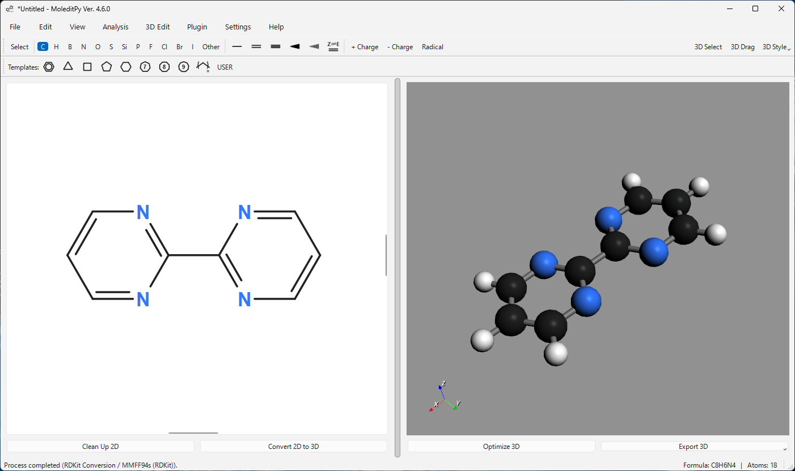

# MoleditPy macOS App Bundle

## Overview

MoleditPy is a cross-platform, simple, and intuitive molecular editor built in Python.
This package provides a self-contained `MoleditPy.app` bundle built for macOS: it carries its own Python interpreter and every library, so no Python installation and no `pip install` is required.



## About This Version

This macOS package uses `moleditpy-linux`, in which the Open Babel library has been disabled due to compatibility issues.
While features dependent on Open Babel (3D conversion fallback) are unavailable, basic molecular drawing and editing functions operate without issues.

For complex molecules that require Open Babel fallback, 3D conversion may fail. In such cases, please try changing `3D Conversion` to `Direct` in the `Settings`. You can also temporarily switch to this mode by right-clicking the `Convert 2D to 3D` button.

The bundle is built for **Apple Silicon (arm64)** only, and is ad-hoc signed rather than notarized by Apple. On an Intel Mac, or for the full feature set, install with `pip` instead — see [Installation for macOS](https://github.com/HiroYokoyama/python_molecular_editor/wiki/Installation-for-macOS).

Note: As `pip` is not included in this package, plugins requiring external dependencies cannot be executed. In addition, this bundle runs **without a terminal window**, so console output is only available through the log file. See [Limitations](#limitations) below.

## Download

Please download the app bundle from the link below.
The download will start upon clicking.

[Download MoleditPy for macOS (Apple Silicon)](https://github.com/HiroYokoyama/python_molecular_editor/releases/download/v4.7.1/MoleditPy_4.7.1_macos_arm64.zip)

## Installation Steps

1.  **Download**
    Download the archive (.zip) from the link above. Safari unpacks it automatically; in other browsers, double-click the downloaded file.

2.  **Move to Applications**
    Drag `MoleditPy.app` into your `Applications` folder.

3.  **First Launch**
    Right-click (or Control-click) `MoleditPy.app` and choose **Open**, then confirm **Open** in the dialog.

    *Note: Because the app is not notarized, macOS blocks a plain double-click the first time. macOS remembers the choice, so later launches are a normal double-click.*

    *If macOS reports that the app "is damaged and can't be opened", clear the download quarantine flag from Terminal:*

    ```bash
    xattr -dr com.apple.quarantine /Applications/MoleditPy.app
    ```

4.  **Completion**
    MoleditPy starts as a normal macOS application, and can be kept in the Dock.

## Limitations

This bundle is a frozen application rather than a Python environment, which has three consequences.

1.  **Plugins that need external packages cannot run.**
    `pip` is not included, so a plugin that imports a library MoleditPy does not already ship (for example one requiring `PySCF` or `SciPy`) cannot be used. Plugins that rely only on what MoleditPy itself bundles continue to work.

2.  **There is no terminal window.**
    The bundle is a windowed macOS app, so Python's console output — startup messages, warnings and tracebacks — is not shown anywhere. This differs from the `MoleditPy.app` created by `moleditpy-installer`, which deliberately launches through Terminal to keep that output visible.

    Use the built-in file logging instead:

      * Enable **Settings ▸ Other ▸ `Save log to file (~/.moleditpy/moleditpy.log)`**, and for full detail also `Enable DEBUG level logging`.
      * Logging changes take effect after a restart.
      * The log is written to `~/.moleditpy/moleditpy.log` (rotated, max 1 MB × 3).
      * Read it in Console.app, or follow it live in Terminal:

        ```bash
        tail -f ~/.moleditpy/moleditpy.log
        ```

    Once file logging is on, MoleditPy's error dialogs point at this file, so switching it on before reporting a problem makes the report far more useful.

3.  **No file associations.**
    Double-clicking a `.pmeprj` or `.mol` file does not open it in this bundle. Use **File ▸ Open** inside the app, or install with `pip` plus `moleditpy-installer`, which registers the `.pmeprj` association.

## Uninstallation

To remove the software, drag `/Applications/MoleditPy.app` to the Trash. Settings, plugins and logs live in `~/.moleditpy`; delete that folder as well for a complete removal.

## System Requirements

  * **OS**: macOS 11 Big Sur or later (macOS 14 or later recommended)
  * **Processor**: Apple Silicon (M1 or later)
  * **Memory**: 4GB or more recommended

## Disclaimer

The developer assumes no responsibility for any damages arising from the use of this software. Please use it at your own risk.
