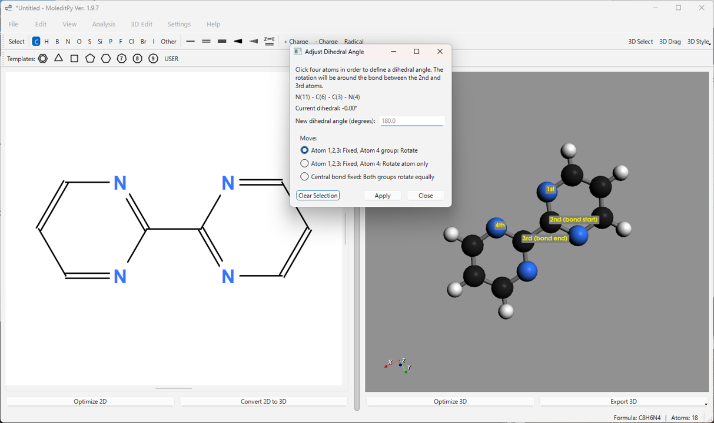
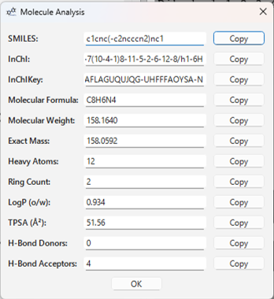
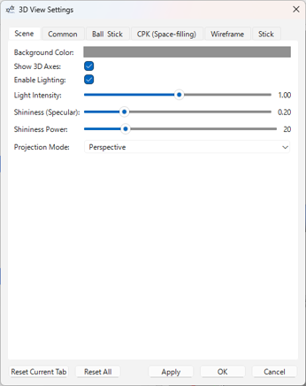

# MoleditPy ユーザーマニュアル

## 1\. はじめに

MoleditPy は、Python で開発された分子編集ソフトウェアです。直感的なインターフェースを通じて、2D での分子構造の描画・編集、および 3D 構造の生成・表示・簡単な編集を行うことができます。

**主な機能:**

  * **2D 分子編集:** 原子や結合の追加・削除・変更、テンプレートを用いた構造作成。ユーザーが指定した構造を保存・利用できるユーザーテンプレートにも対応しています。
  * **3D 構造生成:** RDKit や Open Babel (オプション) を利用した 2D 構造からの 3D 座標生成および構造最適化。
  * **3D 分子表示:** Ball & Stick, CPK (空間充填), Wireframe, Stick など、複数のスタイルでの 3D 分子表示。
  * **ファイル操作:** 独自形式 (.pmeprj) でのプロジェクト保存・読み込み、標準的な化学ファイル形式 (MOL, SDF, XYZ) や SMILES, InChI 文字列のインポート・エクスポートに対応。エクスポートされたファイルは、DFT計算へ使用することができます。画像 (PNG) や 3D印刷用の3D モデル (STL, OBJ) としてのエクスポートも可能。
  * **分子分析:** SMILES, InChI, 分子式, 分子量, LogP, TPSA などの基本的な分子特性を表示。
  * **3D 測定:** 3D ビュー上で原子間の距離、3 原子間の角度、4 原子間の二面角を測定。
  * **3D 編集:** 分子全体の平行移動、選択原子の平面化、特定軸への整列、結合長・角度・二面角の調整、鏡像作成。
  * **カスタマイズ:** 3D 表示の背景色、ライティング、表示スタイル詳細などを設定可能。

  
  
  

-----

## 2\. インストールと起動

インストールはpipを用いて行えます。

Windows/MacOS
```bash
pip install moleditpy
```
Linux
```bash
pip install moleditpy-linux
```

**起動:**

以下のコマンドで起動できます。

```bash
moleditpy
```

-----

## 3\. 画面構成

MoleditPy のメインウィンドウは、主に以下の要素で構成されています。

1.  **メニューバー:** ファイル操作、編集、表示、分析、設定、ヘルプなどの機能が含まれます。
2.  **メインツールバー:** 原子・結合の描画モード選択、電荷・ラジカル設定、3D 表示スタイル変更などの基本的なツールが配置されています。
3.  **テンプレートツールバー:** 環状構造などのテンプレートを選択するためのボタンが配置されています。
4.  **2D 編集ビュー:** 分子構造を描画・編集するメインのキャンバスです。マウス操作で原子や結合を追加・編集できます。
5.  **3D 表示ビュー:** 生成または読み込んだ分子の 3D 構造を表示します。マウスで回転、ズーム、パン操作が可能です。3D 測定や編集もこのビューで行います。
6.  **スプリッター:** 2D ビューと 3D ビューの間の境界線です。ドラッグして各ビューの表示領域サイズを変更できます。
7.  **ステータスバー:** 現在の操作モード、メッセージ、計算中の分子式・原子数などを表示します。

-----

## 4\. 基本的な操作 (2D 編集ビュー)

2D 編集ビューでは、マウスとツールバー、キーボードショートカットを使って分子構造を作成・編集します。

### 4.1. 描画モードの選択

メインツールバーのボタンをクリックするか、対応するキーボードショートカットを押して、描画モードを選択します。

  * **Select (Space):** 原子や結合を選択、移動するモード。
  * **原子ボタン (C, H, N, O など):** 対応する元素の原子を追加するモード。クリックで原子を配置、ドラッグで原子と結合を追加。
  * **結合ボタン (単結合, 二重結合など):** 対応する種類の結合を追加・変更するモード。原子間をドラッグして結合を作成、既存の結合をクリックして種類を変更。
  * **電荷ボタン (+/-):** 原子をクリックして電荷を増減させるモード。右クリックで電荷を 0 にリセット。
  * **ラジカルボタン (Radical):** 原子をクリックしてラジカル電子数をトグル (0 -\> 1 -\> 2 -\> 0) するモード。右クリックで 0 にリセット。
  * **テンプレートボタン (ベンゼン環など):** キャンバスをクリックしてテンプレート構造を追加するモード。既存の原子や結合にスナップして融合させることも可能。

### 4.2. 原子・結合の操作

  * **原子の追加:**
    1.  ツールバーで追加したい元素ボタンを選択 (例: 'C')。
    2.  キャンバスの任意の位置をクリックすると、その元素の原子が配置されます。
  * **結合の追加:**
    1.  ツールバーで追加したい結合ボタンを選択 (例: 単結合)。
    2.  原子 A の上でマウスボタンを押し、原子 B までドラッグして離すと、A と B の間に結合が作成されます。
    3.  空白領域でドラッグを開始し、原子 A 上で離すと、空白領域の開始点に新しい原子 (デフォルトは炭素) が作られ、原子 A との間に結合が作成されます。
    4.  原子 A 上でドラッグを開始し、空白領域で離すと、離した位置に新しい原子 (デフォルトは炭素) が作られ、原子 A との間に結合が作成されます。
  * **原子・結合の選択:**
    1.  ツールバーで 'Select' モードを選択。
    2.  原子または結合をクリックして選択 (複数選択は Shift + クリック)。
    3.  キャンバスの空白領域をドラッグして矩形選択。
  * **移動:**
    1.  'Select' モードで、選択した原子または結合をドラッグします。原子を移動すると、接続している結合も追従します。
  * **削除:**
    1.  'Select' モードまたは任意の描画モード (テンプレート、電荷、ラジカル以外) で、削除したい原子または結合を**右クリック**します。
    2.  'Select' モードでアイテムを選択し、`Delete` または `Backspace` キーを押します。
  * **元素の変更:**
    1.  ツールバーで変更したい先の元素ボタンを選択。
    2.  既存の原子をクリックすると、その原子の元素が変更されます。
    3.  または、マウスカーソルを原子上、ホバー状態で、キーボードショートカット (例: 'N' で窒素) を押します。
  * **結合次数の変更:**
    1.  ツールバーで変更したい先の結合ボタンを選択。
    2.  既存の結合をクリックすると、その結合の種類が変更されます。
    3.  または、'Select' モードで結合を選択し、キーボードショートカット (例: '2' で二重結合) を押します。
  * **立体結合 (Wedge/Dash) の設定:**
    1.  ツールバーで Wedge (太線) または Dash (破線) ボタンを選択。
    2.  既存の単結合をクリックすると、立体表示が設定されます。もう一度クリックすると方向が反転します。
    3.  または、'Select' モードで単結合を選択し、'W' (Wedge) または 'D' (Dash) キーを押します。
  * **二重結合の E/Z 配置:**
    1.  ツールバーで 'Toggle E/Z' ボタン (Z⇌E アイコン) を選択。
    2.  既存の二重結合をクリックすると、立体配置が Z -\> E -\> (指定なし) の順にトグルします。
    3.  または、結合にマウスカーソルを合わせ、'Z' または 'E' キーを押します。

### 4.3. テンプレートの使用

  * **標準テンプレート:** テンプレートツールバーのボタン (ベンゼン環、シクロヘキサン環など) をクリックしてモードを選択し、キャンバスをクリックして配置します。既存の原子や結合の上でクリックすると、構造を融合できます。
  * **ユーザーテンプレート:**
    1.  テンプレートツールバーの 'USER' ボタンをクリックするか、メニューの `File` \> `Save 2D as Template...` で現在の構造をテンプレートとして保存します。
    2.  'USER' ボタンをクリックすると、ユーザーテンプレートダイアログが開きます。
    3.  ダイアログで使いたいテンプレートをクリックすると、そのテンプレートを使用するモードになります。キャンバスをクリックして配置します。ダイアログは開いたままなので、連続して異なるテンプレートを使用できます。

    

### 4.4. Undo/Redo

  * メニューの `Edit` \> `Undo` (Ctrl+Z) および `Redo` (Ctrl+Y / Ctrl+Shift+Z) を使用して、操作を取り消したり、やり直したりできます。

### 4.5. コピー/カット/ペースト

  * 'Select' モードで原子や結合を選択し、メニューの `Edit` \> `Copy` (Ctrl+C) または `Cut` (Ctrl+X) を実行します。
  * メニューの `Edit` \> `Paste` (Ctrl+V) を実行すると、クリップボードの内容がカーソル位置に貼り付けられます。MoleditPy 内部のコピー＆ペーストに対応しています。

-----

## 5\. ファイル操作

メニューバーの `File` メニューから各種ファイル操作を行います。

### 5.1. プロジェクトファイル (.pmeprj (Python Molecular Editor Project File))

  * **New (Ctrl+N):** 現在の作業内容をすべてクリアし、新規状態にします。未保存の変更がある場合は確認ダイアログが表示されます。
  * **Open Project... (Ctrl+O):** 以前に保存したプロジェクトファイル (.pmeprj または .pmeraw) を開きます。
  * **Save Project (Ctrl+S):** 現在の作業内容 (2D 構造、生成済みの 3D 構造など) を現在のプロジェクトファイルに上書き保存します。ファイル名が未設定の場合は「名前を付けて保存」ダイアログが開きます。 **.pmeprj (JSON 形式) が推奨**される形式です。
  * **Save Project As... (Ctrl+Shift+S):** 現在の作業内容を新しい名前または場所でプロジェクトファイル (.pmeprj) として保存します。

### 5.2. インポート

  * **Import \> MOL/SDF File...:** MOL または SDF ファイルを読み込み、2D 構造として表示します。ファイルに 3D 座標が含まれていても、2D 座標が再計算されます (立体化学は保持されます)。
  * **Import \> SMILES...:** SMILES 文字列を入力するダイアログを開き、入力された分子を 2D 構造として表示します。
  * **Import \> InChI...:** InChI 文字列を入力するダイアログを開き、入力された分子を 2D 構造として表示します。
  * **Import \> 3D MOL/SDF (3D View Only)...:** 3D 座標を持つ MOL/SDF ファイルを読み込み、**3D ビューのみに表示**します (2D エディタはクリアされます)。3D ビューアモードになります。
  * **Import \> 3D XYZ (3D View Only)...:** XYZ ファイルを読み込み、**3D ビューのみに表示**します (2D エディタはクリアされます)。原子間距離に基づいて結合が推定されます。3D ビューアモードになります。

### 5.3. エクスポート

  * **Export \> PME Raw Format...:** プロジェクトデータを旧式のバイナリ形式 (.pmeraw) で保存します。
  * **Export \> 2D Formats \> MOL File...:** 現在の 2D 構造を MOL ファイルとして保存します。
  * **Export \> 2D Formats \> PNG Image...:** 現在の 2D 編集ビューの内容を PNG 画像ファイルとして保存します。背景を透過させるか選択できます。
  * **Export \> 3D Formats \> MOL File...:** 現在表示されている 3D 構造を 3D 座標を持つ MOL ファイルとして保存します。
  * **Export \> 3D Formats \> XYZ File...:** 現在表示されている 3D 構造を XYZ ファイルとして保存します。
  * **Export \> 3D Formats \> PNG Image...:** 現在の 3D 表示ビューの内容を PNG 画像ファイルとして保存します。背景を透過させるか選択できます。
  * **Export \> 3D Formats \> STL File...:** 現在の 3D モデルを STL ファイル (色なし、3D プリント用など) として保存します。
  * **Export \> 3D Formats \> OBJ/MTL (with colors)...:** 現在の 3D モデルを OBJ ファイルと MTL ファイル (色情報付き) として保存します。

-----

## 6\. 3D 機能

MoleditPy は、描画した 2D 構造から 3D 構造を生成し、表示、測定、編集を行う機能を提供します。

### 6.1. 2D から 3D への変換

1.  2D 編集ビューで分子構造を描画します。
2.  左下の **Convert 2D to 3D** ボタンをクリックするか、メニューの `Edit` \> `Convert 2D to 3D` (Ctrl+K) を選択します。
3.  計算が開始され、ステータスバーに進捗が表示されます。RDKit (ETKDGv2 アルゴリズム) を使用して 3D 座標が生成され、力場計算 (MMFF94 または UFF) によって簡単な構造最適化が行われます。
4.  成功すると、3D 表示ビューに生成された 3D 構造が表示されます。

**(設定):** メニューの `Settings` \> `3D Conversion` から、変換に使用するライブラリ (RDKit, Open Babel) の優先順位を設定できます。Open Babel がインストールされていない場合、関連するオプションは無効になります。

### 6.2. 3D 構造の最適化

  * 3D 構造が表示されている状態で、右下の **Optimize 3D** ボタンをクリックするか、メニューの `Edit` \> `Optimize 3D` (Ctrl+L) を選択します。
  * 選択されている力場 (MMFF または UFF) を用いて、より詳細な構造最適化計算が実行されます。
  * 完了すると、最適化された構造が 3D ビューに再描画されます。

**(設定):** メニューの `Edit` \> `3D Optimization Settings` または `Settings` \> `3D Optimization Settings` から、使用する力場計算ライブラリとメソッド (RDKit MMFF/UFF) を選択できます。

### 6.3. 3D 表示スタイルの変更

メインツールバー右側の **3D Style** ドロップダウンメニューから、表示スタイルを選択できます。

  * **Ball & Stick:** 原子を球 (ファンデルワールス半径の縮小版)、結合を棒で表示します。標準的なスタイルです。
  * **CPK (Space-filling):** 原子をファンデルワールス半径に基づいた空間充填球で表示します。分子の体積や形状を視覚化するのに適しています。
  * **Wireframe:** 結合のみを細い線で表示します。原子は表示されません。
  * **Stick:** 結合を太い棒で、原子を小さな球で表示します。

**(設定):** 各表示スタイルの詳細 (原子サイズ、結合半径、描画品質など) は、メニューの `Settings` \> `3D View Settings...` から調整できます。

### 6.4. 3D ビューの操作

  * **回転:** マウスの左ボタンドラッグ。
  * **ズーム:** マウスホイールの回転 (Ctrl + ホイールでも可)。
  * **パン (移動):** マウスの中ボタンドラッグ、または Shift + 左ボタンドラッグ。
  * **ビューのリセット:** メニューの `View` \> `Reset 3D View` (Ctrl+R) で、カメラの位置とズームを初期状態に戻します。

### 6.5. 3D 測定機能 ("3D Select" モード)

1.  メインツールバーの **3D Select** ボタンをクリックして、測定モードを有効にします。
2.  3D ビュー上で原子をクリックして選択します。選択された原子には順番に番号 (1, 2, 3, 4) が赤いラベルで表示されます。
3.  選択した原子の数に応じて、以下の測定値が計算され、3D ビューの左上に表示されます。
      * **2 原子選択:** 原子間距離 (Å)
      * **3 原子選択:** 距離 (1-2) および角度 (1-2-3) (°)
      * **4 原子選択:** 距離 (1-2)、角度 (1-2-3) および二面角 (1-2-3-4) (°)
4.  原子以外をクリックするか、**Clear Selection** ボタン (表示されている場合)、または **3D Select** ボタンを再度クリックしてモードを解除すると、選択と測定値がクリアされます。

  

### 6.6. 3D 編集機能 ("3D Drag" モード / Alt キー)

3D 構造の原子座標を直接編集できます。メインツールバーの **3D Drag** ボタンをオンにするか、**Alt キーを押しながら**操作します。

  * **原子のドラッグ:** 3D Drag モード中、原子をクリックしてドラッグすると、その原子を 3D 空間内で移動できます。マウスボタンを離すと位置が確定します。

  

**その他の 3D 編集機能 (メニュー `3D Edit`):**

これらの機能は、3D 構造が表示されている場合にメニューから利用できます。多くは専用のダイアログが開き、そこで原子を選択したり、パラメータを入力したりします。

  * **Translation...:** 分子全体または選択した原子群を、指定した座標に平行移動します。
  * **Align to \> Axis \> (X/Y/Z)-axis...:** 選択した 2 原子を結ぶ線が、指定した座標軸 (X, Y, または Z) に沿うように、分子全体を回転・移動します (1 番目の原子が原点に、2 番目の原子が軸上に配置されます)。
  * **Align to \> Plane \> (XY/XZ/YZ)-plane...:** 選択した 3 原子以上を含む平面が、指定した座標平面 (XY, XZ, または YZ) と平行になるように、分子全体を回転します。
  * **Mirror...:** 分子全体の鏡像を指定した平面 (XY, XZ, YZ) に対して作成します。
  * **Adjust Bond Length...:** 選択した 2 原子間の距離を指定した値に変更します。片方の原子（または接続グループ）を固定するか、両方を動かすか選択できます。
  * **Adjust Angle...:** 選択した 3 原子 (1-2-3) がなす角度を指定した値に変更します。原子 3 側（または接続グループ）を回転させるか、両腕を均等に回転させるか選択できます。
  * **Adjust Dihedral Angle...:** 選択した 4 原子 (1-2-3-4) がなす二面角を指定した値に変更します。原子 4 側（または接続グループ）を回転させるか、両グループを均等に回転させるか選択できます。

  
  
  

### 6.7. 原子情報の表示

メニューの `View` \> `3D Atom Info Display` から、3D ビューの各原子の上に表示する情報を選択できます。

  * **Show Original ID / Index (または Show XYZ Unique ID):** 2D エディタ由来の場合は元の ID、XYZ ファイル由来の場合は XYZ ファイル内でのインデックスを表示します。
  * **Show RDKit Index:** RDKit 内部での原子インデックスを表示します。
  * **Show Coordinates (X,Y,Z):** 各原子の 3D 座標を表示します。
  * **Show Element Symbol:** 各原子の元素記号を表示します。

同じメニュー項目を再度選択すると、表示がオフになります。

-----

## 7\. 分子分析

メニューの `Analysis` \> `Show Analysis...` を選択すると、現在 3D ビューに表示されている分子 (XYZ 由来を除く) の基本的な特性を計算し、表示するダイアログが開きます。

表示される情報例:

  * SMILES 文字列
  * InChI 文字列 / InChIKey
  * 分子式
  * 分子量
  * 精密質量
  * 重原子数
  * 環の数
  * LogP (オクタノール/水分配係数)
  * TPSA (極性表面積)
  * 水素結合供与体/受容体の数

各値の横にある **Copy** ボタンで、その値をクリップボードにコピーできます。

  

-----

## 8\. 設定

メニューの `Settings` \> `3D View Settings...` から、3D 表示に関する様々な設定を変更できます。

設定可能な項目:

  * **Scene タブ:**
      * 背景色
      * 3D 座標軸の表示/非表示
      * ライティングの有効/無効
      * 光の強度
      * 表面の光沢 (Specular) とその強さ (Specular Power)
      * カメラの投影モード (Perspective / Orthographic)
  * **Common タブ:**
      * 多重結合の表示オフセットと太さ
      * XYZ ファイルインポート時に化学的妥当性チェックをスキップするかどうか
  * **各表示スタイル (Ball & Stick, CPK, Wireframe, Stick) タブ:**
      * 原子サイズ/半径のスケール
      * 結合半径
      * 描画品質 (Resolution)

**Apply** ボタンで設定を即座に反映し、**OK** ボタンで適用してダイアログを閉じます。**Reset Current Tab** / **Reset All** で設定をデフォルトに戻すこともできます。設定は次回起動時にも保持されます。

  

-----

## 9\. キーボードショートカット

| キー           | 機能 (Select モード)                               | 機能 (描画/編集モード)                                     |
| :------------- | :------------------------------------------------- | :--------------------------------------------------------- |
| `Space`        | Select モードに切り替え / 全選択 (選択なしの場合) | Select モードに切り替え                                   |
| `C`, `H`, `N`, `O`, `S`, `P`, `F`, `I`, `B` | 対応する原子描画モードに切り替え / カーソル下の原子をその元素に変更 | 対応する原子描画モードに切り替え                          |
| `Shift`+`C`    | Cl 描画モード / カーソル下の原子を Cl に変更          | Cl 描画モード                                             |
| `Shift`+`S`    | Si 描画モード / カーソル下の原子を Si に変更          | Si 描画モード                                             |
| `Shift`+`B`    | Br 描画モード / カーソル下の原子を Br に変更          | Br 描画モード                                             |
| `1`            | 単結合描画モード / 選択結合 or カーソル下結合を単結合に / 原子に原子を追加 | 単結合描画モード                                         |
| `2`            | 二重結合描画モード / 選択結合 or カーソル下結合を二重結合に | 二重結合描画モード                                       |
| `3`            | 三重結合描画モード / 選択結合 or カーソル下結合を三重結合に | 三重結合描画モード                                       |
| `W`            | Wedge 結合描画モード / 選択結合 or カーソル下結合を Wedge に (クリックで反転) | Wedge 結合描画モード                                    |
| `D`            | Dash 結合描画モード / 選択結合 or カーソル下結合を Dash に (クリックで反転) | Dash 結合描画モード                                     |
| `Z` / `E`      | (カーソル下の二重結合に対して) Z / E 配置を指定         | (カーソル下の二重結合に対して) Z / E 配置を指定            |
| `.` (ピリオド) | 選択原子 or カーソル下原子のラジカルをトグル (0-\>1-\>2-\>0) | 選択原子 or カーソル下原子のラジカルをトグル (0-\>1-\>2-\>0) |
| `+` / `-`      | 選択原子 or カーソル下原子の電荷を増減               | 選択原子 or カーソル下原子の電荷を増減                  |
| `Delete` / `Backspace` | 選択アイテム or カーソル下のアイテムを削除              | (描画操作中に) 操作をキャンセル / 選択アイテム or カーソル下のアイテムを削除 |
| `Ctrl`+`Z`     | Undo                                               | Undo                                                      |
| `Ctrl`+`Y` / `Ctrl`+`Shift`+`Z` | Redo | Redo |
| `Ctrl`+`C`     | Copy Selection                                     | Copy Selection                                            |
| `Ctrl`+`X`     | Cut Selection                                      | Cut Selection                                             |
| `Ctrl`+`V`     | Paste                                              | Paste                                                     |
| `Ctrl`+`A`     | Select All                                         | Select All                                                |
| `Ctrl`+`N`     | New                                                | New                                                       |
| `Ctrl`+`O`     | Open Project...                                    | Open Project...                                           |
| `Ctrl`+`S`     | Save Project                                       | Save Project                                              |
| `Ctrl`+`Shift`+`S` | Save Project As...                             | Save Project As...                                        |
| `Ctrl`+`J`     | Optimize 2D                                        | Optimize 2D                                               |
| `Ctrl`+`K`     | Convert 2D to 3D                                   | Convert 2D to 3D                                          |
| `Ctrl`+`L`     | Optimize 3D                                        | Optimize 3D                                               |
| `Ctrl`+`+`     | Zoom In (2D View)                                  | Zoom In (2D View)                                         |
| `Ctrl`+`-`     | Zoom Out (2D View)                                 | Zoom Out (2D View)                                        |
| `Ctrl`+`0`     | Reset Zoom (2D View)                               | Reset Zoom (2D View)                                      |
| `Ctrl`+`9`     | Fit to View (2D View)                              | Fit to View (2D View)                                     |
| `Ctrl`+`R`     | Reset 3D View                                      | Reset 3D View                                             |
| `Ctrl`+`1`     | Panel Layout 50:50                                 | Panel Layout 50:50                                        |
| `Ctrl`+`2`     | Panel Layout 70:30 (2D Focus)                      | Panel Layout 70:30 (2D Focus)                             |
| `Ctrl`+`3`     | Panel Layout 30:70 (3D Focus)                      | Panel Layout 30:70 (3D Focus)                             |
| `Ctrl`+`H`     | Toggle 2D Panel Visibility                         | Toggle 2D Panel Visibility                                |
| `Alt`+`Drag`   | (3D View) 一時的に 3D Drag モード                     | (3D View) 一時的に 3D Drag モード                        |
| `Ctrl`+`Click` | (3D View) 3D編集用に原子を選択/選択解除             | (3D View) 3D編集用に原子を選択/選択解除                |
| `Ctrl`+`Q`     | Quit                                               | Quit                                                      |

-----

## 10\. バージョン情報 / ライセンス

  * **バージョン:** 1.9.7
  * **作者:** Hiromichi Yokoyama
  * **ライセンス:** Apache-2.0 license
  * **リポジトリ:** [https://github.com/HiroYokoyama/python\_molecular\_editor](https://github.com/HiroYokoyama/python_molecular_editor)
  * **DOI:** 10.5281/zenodo.17268532

メニューの `Help` \> `About` からバージョン情報を確認できます。

-----

