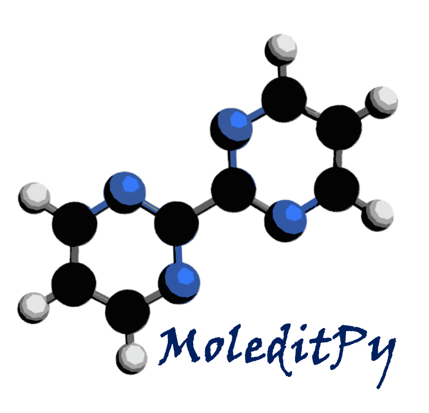
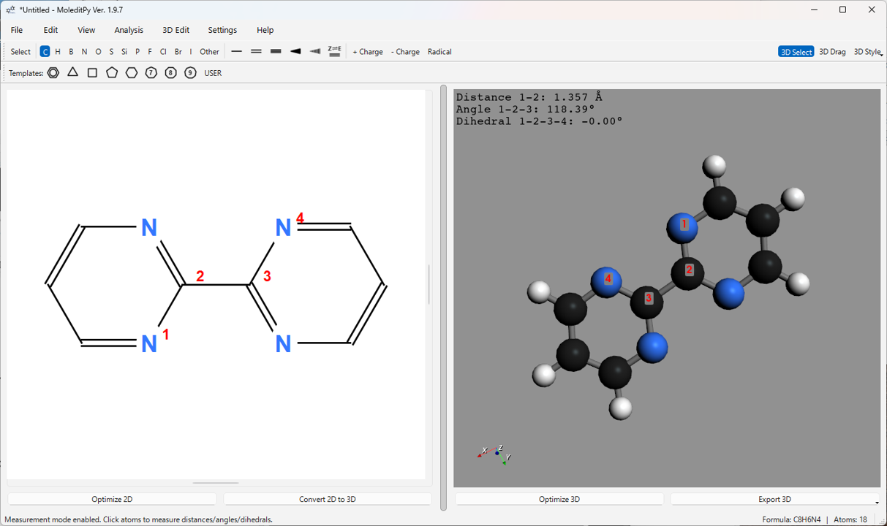

# MoleditPy User Manual

## 1\. Introduction

MoleditPy is a molecular editing software developed in Python. Through an intuitive interface, it allows for the drawing and editing of molecular structures in 2D, as well as the generation, display, and editing of 3D structures.

**Main Features:**

  * **2D Molecular Editing:** Add, delete, or modify atoms and bonds; create structures using templates. Also supports user templates, allowing users to save and use their own specified structures.
  * **3D Structure Generation:** Generate 3D coordinates from 2D structures and perform structure optimization using RDKit or Open Babel (optional).
  * **3D Molecular Display:** Display 3D molecules in multiple styles, including Ball & Stick, CPK (Space-filling), Wireframe, and Stick.
  * **File Operations:** Save and load projects in a proprietary format (.pmeprj). Supports import and export of standard chemical file formats (MOL, SDF, XYZ) and SMILES, InChI strings. Exported files can be used for DFT calculations. Also supports exporting as images (PNG) or 3D models (STL, OBJ) for 3D printing.
  * **Molecular Analysis:** Display basic molecular properties such as SMILES, InChI, Molecular Formula, Molecular Weight, LogP, and TPSA.
  * **3D Measurement:** Measure distances between atoms, angles between three atoms, and dihedral angles between four atoms in the 3D view.
  * **3D Editing:** Translate the entire molecule, **planarize selected atoms**, align to specific axes, adjust bond lengths, angles, and dihedral angles, and create mirror images.
  * **Customization:** Configure 3D display settings such as background color, lighting, and detailed display styles.

  

  

-----

## 2\. Installation and Launch

Installation can be done using pip.

Windows/MacOS

```bash
pip install moleditpy
```

Linux

```bash
pip install moleditpy-linux
```

**Launch:**

You can launch it with the following command.

```bash
moleditpy
```

-----

## 3\. Screen Layout

The MoleditPy main window is primarily composed of the following elements:

1.  **Menu Bar:** Contains functions for file operations, editing, viewing, analysis, settings, and help.
2.  **Main Toolbar:** Provides basic tools for selecting atom/bond drawing modes, setting charges/radicals, and changing 3D display styles.
3.  **Template Toolbar:** Contains buttons for selecting templates such as ring structures.
4.  **2D Edit View:** The main canvas for drawing and editing molecular structures. You can add and edit atoms and bonds using mouse operations.
5.  **3D View:** Displays the 3D structure of the generated or loaded molecule. You can rotate, zoom, and pan with the mouse. 3D measurement and editing are also performed in this view.
6.  **Splitter:** The boundary line between the 2D view and the 3D view. You can drag it to resize the display area of each view.
7.  **Status Bar:** Displays the current operation mode, messages, and the molecular formula/atom count being calculated.

-----

## 4\. Basic Operations (2D Edit View)

In the 2D Edit View, you create and edit molecular structures using the mouse, toolbar, and keyboard shortcuts.

### 4.1. Selecting a Drawing Mode

Select a drawing mode by clicking a button on the main toolbar or pressing the corresponding keyboard shortcut.

  * **Select (Space):** Mode for selecting and moving atoms or bonds.
  * **Atom buttons (C, H, N, O, etc.):** Mode for adding the corresponding element's atom. Click to place an atom; drag to add an atom and a bond.
  * **Bond buttons (Single bond, Double bond, etc.):** Mode for adding or changing the corresponding type of bond. Drag between atoms to create a bond; click an existing bond to change its type.
  * **Charge buttons (+/-):** Mode for increasing or decreasing the charge on an atom by clicking it. Right-click to reset the charge to 0.
  * **Radical button (Radical):** Mode for toggling the number of radical electrons on an atom (0 -\> 1 -\> 2 -\> 0) by clicking it. Right-click to reset to 0.
  * **Template buttons (Benzene ring, etc.):** Mode for adding a template structure by clicking on the canvas. It can also snap to and merge with existing atoms or bonds.

### 4.2. Atom and Bond Operations

  * **Adding an Atom:**
    1.  Select the desired element button from the toolbar (e.g., 'C').
    2.  Click anywhere on the canvas to place an atom of that element.
  * **Adding a Bond:**
    1.  Select the desired bond button from the toolbar (e.g., Single bond).
    2.  Press the mouse button on Atom A, drag to Atom B, and release to create a bond between A and B.
    3.  Start dragging in an empty area and release on Atom A to create a new atom (default Carbon) at the start point, bonded to Atom A.
    4.  Start dragging on Atom A and release in an empty area to create a new atom (default Carbon) at the release point, bonded to Atom A.
  * **Selecting Atoms/Bonds:**
    1.  Select 'Select' mode from the toolbar.
    2.  Click an atom or bond to select it (Shift + Click for multiple selections).
    3.  Drag in an empty area of the canvas to make a rectangular selection.
  * **Moving:**
    1.  In 'Select' mode, drag the selected atom or bond. When an atom is moved, its connected bonds follow.
  * **Deleting:**
    1.  In 'Select' mode or any drawing mode (except template, charge, or radical), **right-click** the atom or bond you want to delete.
    2.  In 'Select' mode, select items and press the `Delete` or `Backspace` key.
  * **Changing an Element:**
    1.  Select the button for the element you want to change to from the toolbar.
    2.  Click an existing atom to change its element.
    3.  Alternatively, hover the mouse cursor over an atom and press the keyboard shortcut (e.g., 'N' for Nitrogen).
  * **Changing Bond Order:**
    1.  Select the button for the bond type you want to change to from the toolbar.
    2.  Click an existing bond to change its type.
    3.  Alternatively, in 'Select' mode, select a bond and press a keyboard shortcut (e.g., '2' for a double bond).
  * **Setting Stereo Bonds (Wedge/Dash):**
    1.  Select the Wedge (solid) or Dash (dashed) button from the toolbar.
    2.  Click an existing single bond to set the stereo display. Click again to reverse the direction.
    3.  Alternatively, in 'Select' mode, select a single bond and press 'W' (Wedge) or 'D' (Dash).
  * **E/Z Configuration of Double Bonds:**
    1.  Select the 'Toggle E/Z' button (Z⇌E icon) from the toolbar.
    2.  Click an existing double bond to toggle its stereo configuration in the order Z -\> E -\> (unspecified).
    3.  Alternatively, hover the mouse cursor over the bond and press the 'Z' or 'E' key.

### 4.3. Using Templates

  * **Standard Templates:** Click a button on the template toolbar (benzene ring, cyclohexane ring, etc.) to select the mode, then click on the canvas to place it. Clicking on an existing atom or bond allows you to merge the structures.

  * **User Templates:**

    1.  Click the 'USER' button on the template toolbar or use the menu `File` \> `Save 2D as Template...` to save the current structure as a template.
    2.  Clicking the 'USER' button opens the user template dialog.
    3.  Click the template you want to use in the dialog to enter that template's mode. Click on the canvas to place it. The dialog remains open, allowing you to continuously use different templates.

    

### 4.4. Undo/Redo

  * Use `Edit` \> `Undo` (Ctrl+Z) and `Redo` (Ctrl+Y / Ctrl+Shift+Z) from the menu to undo or redo operations.

### 4.5. Copy/Cut/Paste

  * In 'Select' mode, select atoms or bonds and execute `Edit` \> `Copy` (Ctrl+C) or `Cut` (Ctrl+X) from the menu.
  * Execute `Edit` \> `Paste` (Ctrl+V) from the menu to paste the clipboard contents at the cursor's position. This supports internal copy & paste within MoleditPy.

-----

## 5\. File Operations

Perform various file operations from the `File` menu in the menu bar.

### 5.1. Project Files (.pmeprj (Python Molecular Editor Project File))

  * **New (Ctrl+N):** Clears all current work and starts a new session. A confirmation dialog will appear if there are unsaved changes.
  * **Open Project... (Ctrl+O):** Opens a previously saved project file (.pmeprj or .pmeraw).
  * **Save Project (Ctrl+S):** Overwrites the current project file with the current work (2D structure, generated 3D structure, etc.). If no file name is set, the "Save As" dialog will open. **.pmeprj (JSON format) is the recommended format.**
  * **Save Project As... (Ctrl+Shift+S):** Saves the current work as a project file (.pmeprj) with a new name or location.

### 5.2. Import

  * **Import \> MOL/SDF File...:** Loads a MOL or SDF file and displays it as a 2D structure. Even if the file contains 3D coordinates, 2D coordinates will be recalculated (stereochemistry is preserved).
  * **Import \> SMILES...:** Opens a dialog to input a SMILES string and displays the input molecule as a 2D structure.
  * **Import \> InChI...:** Opens a dialog to input an InChI string and displays the input molecule as a 2D structure.
  * **Import \> 3D MOL/SDF (3D View Only)...:** Loads a MOL/SDF file with 3D coordinates and displays it **in the 3D view only** (the 2D editor is cleared). This enters 3D viewer mode.
  * **Import \> 3D XYZ (3D View Only)...:** Loads an XYZ file and displays it **in the 3D view only** (the 2D editor is cleared). Bonds are estimated based on interatomic distances. This enters 3D viewer mode.

### 5.3. Export

  * **Export \> PME Raw Format...:** Saves project data in the legacy binary format (.pmeraw).
  * **Export \> 2D Formats \> MOL File...:** Saves the current 2D structure as a MOL file.
  * **Export \> 2D Formats \> PNG Image...:** Saves the current 2D Edit View content as a PNG image file. You can choose whether to make the background transparent.
  * **Export \> 3D Formats \> MOL File...:** Saves the currently displayed 3D structure as a MOL file with 3D coordinates.
  * **Export \> 3D Formats \> XYZ File...:** Saves the currently displayed 3D structure as an XYZ file.
  * **Export \> 3D Formats \> PNG Image...:** Saves the current 3D View content as a PNG image file. You can choose whether to make the background transparent.
  * **Export \> 3D Formats \> STL File...:** Saves the current 3D model as an STL file (no color, e.g., for 3D printing).
  * **Export \> 3D Formats \> OBJ/MTL (with colors)...:** Saves the current 3D model as an OBJ file and an MTL file (with color information).

-----
## 6\. 3D Functions

MoleditPy provides functions to generate, display, measure, and edit 3D structures from the drawn 2D structure.

### 6.1. 2D to 3D Conversion

1.  Draw a molecular structure in the 2D Edit View.
2.  Click the **Convert 2D to 3D** button in the bottom left, or select `Edit` \> `Convert 2D to 3D` (Ctrl+K) from the menu.
3.  The calculation begins, and progress is displayed in the status bar. 3D coordinates are generated using RDKit (ETKDGv2 algorithm), and a simple structure optimization is performed using a force field (MMFF94 or UFF).
4.  Upon success, the generated 3D structure is displayed in the 3D View.

**(Settings):** You can set the priority of libraries (RDKit, Open Babel) used for conversion, **or select the "Direct" mode (use 2D coords + add H)**, from the menu `Settings` \> `3D Conversion`. If Open Babel is not installed, related options will be disabled.

### 6.2. 3D Structure Optimization

  * With a 3D structure displayed, click the **Optimize 3D** button in the bottom right, or select `Edit` \> `Optimize 3D` (Ctrl+L) from the menu.
  * A more detailed structure optimization calculation is performed using the selected force field (MMFF or UFF).
  * When completed, the optimized structure is redrawn in the 3D view.

**(Settings):** You can select the force field calculation library and method (RDKit MMFF/UFF) from the menu `Settings` \> `3D Optimization Settings`.

### 6.3. Changing 3D Display Style

You can select the display style from the **3D Style** dropdown menu on the right side of the main toolbar.

  * **Ball & Stick:** Displays atoms as spheres (a scaled-down version of van der Waals radii) and bonds as sticks. This is the standard style.
  * **CPK (Space-filling):** Displays atoms as space-filling spheres based on their van der Waals radii. Suitable for visualizing the volume and shape of the molecule.
  * **Wireframe:** Displays only bonds as thin lines. Atoms are not displayed.
  * **Stick:** Displays bonds as thick sticks and atoms as small spheres.

**(Settings):** Details for each display style (atom size, bond radius, **multiple bond offsets**, rendering quality, etc.) can be adjusted from the menu `Settings` \> `3D View Settings...`.

### 6.4. 3D View Operations

  * **Rotate:** Left mouse button drag.
  * **Zoom:** Mouse wheel scroll (or Ctrl + Wheel).
  * **Pan (Move):** Middle mouse button drag, or Shift + Left mouse button drag.
  * **Reset View:** `View` \> `Reset 3D View` (Ctrl+R) from the menu resets the camera position and zoom to their initial state.

### 6.5. 3D Measurement Function ("3D Select" Mode)

1.  Click the **3D Select** button on the main toolbar to enable measurement mode.

2.  Click atoms in the 3D view to select them. Selected atoms are displayed with red labels in order (1, 2, 3, 4).

3.  Depending on the number of selected atoms, the following measurements are calculated and displayed in the upper-left corner of the 3D view:

      * **2 atoms selected:** Distance between atoms (Å)
      * **3 atoms selected:** Distance (1-2) and Angle (1-2-3) (°)
      * **4 atoms selected:** Distance (1-2), Angle (1-2-3), and Dihedral Angle (1-2-3-4) (°)

4.  Clicking anywhere other than an atom, or clicking the **3D Select** button again to exit the mode will clear the selection and measurements.

 

### 6.6. 3D Editing Function ("3D Drag" Mode / Alt Key)

You can directly edit the atomic coordinates of the 3D structure. Turn on the **3D Drag** button on the main toolbar, or perform operations **while holding down the Alt key**.

  * **Atom Drag:** In 3D Drag mode, clicking and dragging an atom allows you to move it in 3D space. The position is confirmed when you release the mouse button.

   

**Other 3D Editing Functions (Menu `3D Edit`):**

These functions are available from the menu when a 3D structure is displayed. Many open a dedicated dialog where you can select atoms or input parameters.

  * **Translation...:** Translates the entire molecule or a selected group of atoms by specified coordinates. **An option to translate only the selected atoms is also available.**

  * **Align to \> Axis \> (X/Y/Z)-axis...:** Rotates and moves the entire molecule so that the line connecting two selected atoms aligns with the specified coordinate axis (X, Y, or Z) (the first atom is placed at the origin, the second on the axis).

  * **Align to \> Plane \> (XY/XZ/YZ)-plane...:** Rotates the entire molecule so that the plane containing three or more selected atoms becomes parallel to the specified coordinate plane (XY, XZ, or YZ).

  * **Mirror...:** Creates a mirror image of the entire molecule with respect to a specified plane (XY, XZ, YZ).

  * **Adjust Bond Length...:** Changes the distance between two selected atoms to a specified value. You can choose to fix one atom (or its connected group) or move both.

  * **Adjust Angle...:** Changes the angle formed by three selected atoms (1-2-3) to a specified value. You can choose to rotate the atom 3 side (or its connected group) or rotate both arms equally.

  * **Adjust Dihedral Angle...:** Changes the dihedral angle formed by four selected atoms (1-2-3-4) to a specified value. You can choose to rotate the atom 4 side (or its connected group) or rotate both groups equally.

  * **Planarize...:** Calculates the best-fit plane for three or more selected atoms and projects those atoms onto that plane.


  
  
  

### 6.7. Displaying Atom Information

From the menu `View` \> `3D Atom Info Display`, you can select the information to be displayed above each atom in the 3D view.

  * **Show Original ID / Index (or Show XYZ Unique ID):** Displays the original ID if from the 2D editor, or the index within the XYZ file if from an XYZ file.
  * **Show RDKit Index:** Displays the internal RDKit atom index.
  * **Show Coordinates (X,Y,Z):** Displays the 3D coordinates of each atom.
  * **Show Element Symbol:** Displays the element symbol for each atom.

Selecting the same menu item again will turn off the display.

-----

## 7\. Molecular Analysis

Selecting `Analysis` \> `Show Analysis...` from the menu will open a dialog that calculates and displays the basic properties of the molecule currently displayed in the 3D view (excluding those from XYZ files).

Example of displayed information:

  * SMILES String
  * InChI String / InChIKey
  * Molecular Formula
  * Molecular Weight
  * Exact Mass
  * Heavy Atom Count
  * Number of Rings
  * LogP (Octanol-water partition coefficient)
  * TPSA (Topological Polar Surface Area)
  * Number of Hydrogen Bond Donors/Acceptors

You can copy each value to the clipboard using the **Copy** button next to it.

  

-----

## 8\. Settings

### 8\. Settings

You can change various settings related to the 3D display from the menu `Settings` \> `3D View Settings...`.

Configurable items:

  * **Scene Tab:**
      * Background color
      * Show/Hide 3D coordinate axes
      * Enable/Disable lighting
      * Light intensity
      * Surface shininess (Specular) and its strength (Specular Power)
      * **Camera projection mode (Perspective / Orthographic)**
  * **Tabs for each display style (Ball & Stick, CPK, Wireframe, Stick):**
      * Atom size/radius scale
      * Bond radius
      * **Multiple bond display offset and thickness (except for CPK)**
      * Rendering quality (Resolution)
  * **Other Tab:**
      * Whether to skip chemical validity checks during XYZ file import

Click the **Apply** button to immediately apply the settings, and the **OK** button to apply and close the dialog. You can also revert settings to default with **Reset Current Tab** / **Reset All**. Settings are retained for the next launch.

  


-----

## 9\. Keyboard Shortcuts

| Key | Function (Select Mode) | Function (Draw/Edit Mode) |
| :--- | :--- | :--- |
| `Space` | Switch to Select mode / Select All (if nothing selected) | Switch to Select mode |
| `C`, `H`, `N`, `O`, `S`, `P`, `F`, `I`, `B` | Switch to corresponding atom draw mode / Change atom under cursor to that element | Switch to corresponding atom draw mode |
| `Shift`+`C` | Cl draw mode / Change atom under cursor to Cl | Cl draw mode |
| `Shift`+`S` | Si draw mode / Change atom under cursor to Si | Si draw mode |
| `Shift`+`B` | Br draw mode / Change atom under cursor to Br | Br draw mode |
| `1` | Single bond draw mode / Change selected or hovered bond to single bond / Add atom to atom | Single bond draw mode |
| `2` | Double bond draw mode / Change selected or hovered bond to double bond | Double bond draw mode |
| `3` | Triple bond draw mode / Change selected or hovered bond to triple bond | Triple bond draw mode |
| `4` | (In empty space) Switch to Benzene mode / (On atom/bond) Place Benzene | (In empty space) Switch to Benzene mode / (On atom/bond) Place Benzene |
| `W` | Wedge bond draw mode / Change selected or hovered bond to Wedge (click to reverse) | Wedge bond draw mode |
| `D` | Dash bond draw mode / Change selected or hovered bond to Dash (click to reverse) | Dash bond draw mode |
| `Z` / `E` | (On hovered double bond) Set Z / E configuration | (On hovered double bond) Set Z / E configuration |
| `.` (Period) | Toggle radical on selected or hovered atom (0-\>1-\>2-\>0) | Toggle radical on selected or hovered atom (0-\>1-\>2-\>0) |
| `+` / `-` | Increase/Decrease charge on selected or hovered atom | Increase/Decrease charge on selected or hovered atom |
| `Delete` / `Backspace` | Delete selected or hovered item | Cancel operation (during drawing) / Delete selected or hovered item |


| Key | Function |
| :--- | :--- |
| `Ctrl`+`Z` | Undo | 
| `Ctrl`+`Y` / `Ctrl`+`Shift`+`Z` | Redo | 
| `Ctrl`+`C` | Copy Selection | 
| `Ctrl`+`X` | Cut Selection | 
| `Ctrl`+`V` | Paste | 
| `Ctrl`+`A` | Select All | 
| `Ctrl`+`N` | New | 
| `Ctrl`+`O` | Open Project... | 
| `Ctrl`+`S` | Save Project |
| `Ctrl`+`Shift`+`S` | Save Project As... |
| `Ctrl`+`J` | Optimize 2D | 
| `Ctrl`+`K` | Convert 2D to 3D | 
| `Ctrl`+`L` | Optimize 3D | 
| `Ctrl`+`+` | Zoom In (2D View) |
| `Ctrl`+`-` | Zoom Out (2D View) | 
| `Ctrl`+`0` | Reset Zoom (2D View) | 
| `Ctrl`+`9` | Fit to View (2D View) | 
| `Ctrl`+`R` | Reset 3D View |
| `Ctrl`+`1` | Panel Layout 50:50 |
| `Ctrl`+`2` | Panel Layout 70:30 (2D Focus) |
| `Ctrl`+`3` | Panel Layout 30:70 (3D Focus) |
| `Ctrl`+`H` | Toggle 2D Panel Visibility | 
| `Alt`+`Drag` | (3D View) Temporarily enter 3D Drag mode | 
| `Ctrl`+`Q` | Quit |

-----

## 10\. Version / License

  * **Version:** 1.12
  * **Author:** Hiromichi Yokoyama
  * **License:** Apache-2.0 license
  * **Repository:** [https://github.com/HiroYokoyama/python\_molecular\_editor](https://github.com/HiroYokoyama/python_molecular_editor)
  * **DOI:** 10.5281/zenodo.17268532

You can check the version information from the `Help` \> `About` menu.

-----


