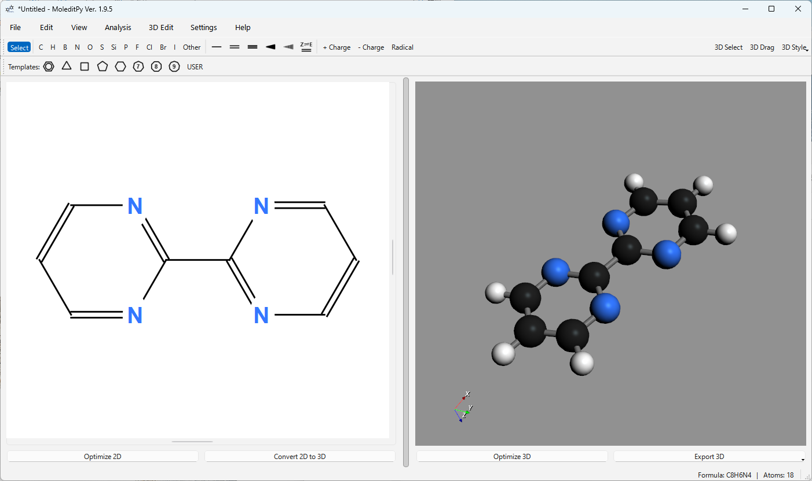

# MoleditPy Windows インストーラー

## 概要

MoleditPyは、Pythonで構築された、クロスプラットフォームでシンプルかつ直感的な分子エディタです。
本インストーラーは、Windows環境向けにビルドされたパッケージを提供します。

## このバージョンについて

このWindows版パッケージは、互換性の問題からOpen Babelライブラリが無効化された`moleditpy-linux`を使用しています。
Open Babelに依存する機能（3D変換のフォールバック）は利用できませんが、基本的な分子描画および編集機能は問題なく動作します。  

Open Babelのフォールバックが必要な複雑な分子では、3D変換が失敗するかもしれません。その場合は、`Settings`から、`3D Conversion`を`Direct`に変更してみてください。`Convert 2D to 3D`ボタンの右クリックで一時的に変更もできます。

## ダウンロード

以下のリンクからインストーラーをダウンロードしてください。
クリックするとダウンロードが開始されます。

[MoleditPy Windows Installer をダウンロード](https://github.com/HiroYokoyama/python_molecular_editor/releases/download/2.1.0/MoleditPy_2.1.0_win64_setup.exe)

## インストール手順

1.  **ダウンロード**
    上記のリンクからセットアップファイル（.exe）をダウンロードします。

2.  **インストーラーの実行**
    ダウンロードしたファイルをダブルクリックして実行してください。

    ※ Windows SmartScreenにより「認識されないアプリ」という警告が表示される場合があります。その際は「詳細情報」をクリックし、「実行」を選択して進めてください。

3.  **セットアップ**
    セットアップウィザードが起動します。画面の指示に従い、「次へ」をクリックしてインストールを進めてください。必要に応じてインストール先のフォルダを指定できます。

4.  **完了**
    インストールが完了すると、スタートメニューにショートカットが追加されます。

## アンインストール方法

ソフトウェアを削除する場合は、Windowsの「設定」＞「アプリ」＞「インストールされているアプリ」を開き、リストから「MoleditPy」を選択して「アンインストール」を実行してください。

## 動作環境

  * **OS**: Windows 10 / 11 (64bit)
  * **プロセッサ**: モダンなx64アーキテクチャプロセッサ
  * **メモリ**: 4GB以上推奨

## 免責事項

本ソフトウェアの使用によって生じたいかなる損害についても、開発者は責任を負いません。自己責任においてご利用ください。

